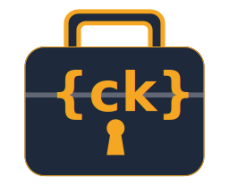

# confkoffer



Bundle, encrypt, and ship project configuration files to an S3-compatible
bucket — and reverse the flow on retrieval.

## The problem

Real projects accumulate sensitive configuration that doesn't belong in
git: provider credentials, backend configs, `.env` files, local
overrides, signing keys. Today, teammates onboard a new machine by
re-running setup scripts from memory, copy-pasting from chat history,
or DM'ing each other zipped folders. Hopping between your laptop, a
work desktop, and a CI box means doing it again. It's tedious,
error-prone, and the "just send me the env file" exchanges are exactly
the kind of thing security audits flag.

confkoffer is a small, focused tool that solves this in a simple and
secure way: pack the files you care about, encrypt them with a
passphrase, push them to a bucket. On any other machine — or after
wiping yours — pull them back down with one command. No GPG keyrings
to sync, no shared password manager folders, no zip-on-Slack. The
bucket can be world-readable as far as confkoffer is concerned;
confidentiality lives in the passphrase.

The name blends **conf**iguration + **koffer** (German for *suitcase*),
echoing the English *coffer* (strongbox). A trusted suitcase for your
configs.

confkoffer is project-agnostic. It does not assume Terraform, Ansible,
Kubernetes, or any specific tool: it packs whatever your `patterns.include`
list selects.

---

## Threat model

confkoffer protects the **confidentiality and integrity** of bundled
config files at rest in an S3-compatible bucket. The trust anchor is the
passphrase you supply at pack time. An attacker who reads or copies the
bucket cannot recover the plaintext without that passphrase.

- Symmetric encryption only — there are no keys to lose, no key servers
  to operate, and no PKI to maintain.
- KDF: Argon2id (OWASP "second-choice" defaults: 19 MiB / t=2 / p=1).
  Each blob carries its own KDF parameters, so you can rotate to a
  stronger profile later without breaking old blobs.
- Cipher: AES-256-GCM. The 35-byte cleartext header is fed in as
  Associated Data, so any tamper (incl. weakening the recorded KDF
  parameters) invalidates the auth tag and decryption fails.

**Use a long passphrase.** Four random words from a wordlist, or 16+
random characters. The KDF makes brute-forcing slow, not impossible.

confkoffer does **not** protect against:

- a compromised local machine where the passphrase is typed or piped;
- a passphrase you also use somewhere else and have leaked elsewhere;
- the bucket operator subpoenaing or mishandling the **encrypted** blob
  (still encrypted, but they have a copy);
- side channels in your own scripts or CI.

---

## Install / build

```sh
go install confkoffer@latest    # once published
# or build from source:
git clone <repo> && cd confkoffer
make build                      # produces ./bin/confkoffer
```

Requires Go 1.26+.

---

## Quickstart

```sh
# 1. Scaffold a config in your project root.
confkoffer init

# 2. Edit .confkoffer.yaml — set 'name' and review patterns.
$EDITOR .confkoffer.yaml

# 3. Export S3 credentials (via env, never via flags).
export AWS_ACCESS_KEY_ID=...
export AWS_SECRET_ACCESS_KEY=...
export AWS_ENDPOINT=s3.amazonaws.com   # or your MinIO/R2/etc. endpoint

# 4. Pack the matched files. You'll be prompted for a passphrase twice.
confkoffer pack

# 5. Later — restore the latest snapshot into restored/:
confkoffer unpack --output-dir restored/

# Or list snapshots and pick a specific one:
confkoffer list
confkoffer unpack --object-key 'my-project/2026-04-28T10-15-00Z-a3f91c-7d4e.enc'

# Or restore as of a point in time:
confkoffer unpack --at 2026-04-28T12:00:00Z
```

---

## Subcommands

| Command   | Purpose |
|-----------|---------|
| `init`    | Write a `.confkoffer.yaml` template into CWD. `--force` overwrites. |
| `pack`    | Walk source dir, encrypt, upload as `<name>/<ts>-<host6>-<rand4>.enc`. |
| `unpack`  | Download a snapshot (default: newest), decrypt, extract. |
| `list`    | Print snapshots under `<name>/`, newest first, with size + key. |

### `unpack` selection flags

`unpack` picks a snapshot using exactly one of:

- (default) the **newest** under `<name>/` by `LastModified`.
- `--object-key <key>` — fetch this exact key.
- `--at <RFC3339>` — newest snapshot at-or-before this UTC timestamp.

`--object-key` and `--at` are mutually exclusive.

`--overwrite` controls behaviour when an extracted file already exists
in `--output-dir`. Default is to skip and report.

---

## Config file reference

Lives in CWD as `.confkoffer.yaml`. Override path with `--config`. There
is no walk-up of parent directories — discovery is CWD-only.

```yaml
name: my-project                # required; lowercase alnum + dashes,
                                # may use "/" for nesting (prod/aws/useast)

storage:
  bucket: confkoffer            # default if omitted: 'confkoffer'
  endpoint: s3.amazonaws.com    # required (no safe default)
  region: eu-central-1          # default: us-east-1

crypto:                         # optional; defaults to OWASP second-choice
  argon2id:                     # OWASP first-choice (stronger):
    memory_kib: 47104
    time: 1
    threads: 1

patterns:
  include:
    - "**/*.tf"
    - "**/*.tfvars"
    - "secrets/prod.env"        # literal paths also work
  exclude:
    - "**/*.tfstate"
    - ".terraform/**"

password:                       # optional; default chain: flag -> env -> prompt
  source: pass                  # one of: prompt | env | flag | pass | command
  pass:
    path: backups/confkoffer/my-project
  # OR universal exec source:
  # source: command
  # command:
  #   argv: ["op", "read", "op://Personal/confkoffer/password"]
  #   timeout: 10s
```

### Resolution order

For any field that can be overridden:

> CLI flag &gt; env var &gt; YAML config &gt; built-in default

### Pattern semantics

- `patterns.include` — glob patterns (or literal paths). A file is a
  candidate if it matches **at least one** include.
- `patterns.exclude` — patterns. A candidate is dropped if it matches
  **any** exclude. Exclude wins.
- `**` matches any number of directory segments. `*` matches one segment
  (does not cross `/`).
- Ergonomic shortcut: `**/foo` also matches `foo` at depth zero (saves
  having to write both `*.tf` and `**/*.tf`).
- Symlinks are skipped (logged at WARN).

---

## Password sources

| Source    | When to use | Notes |
|-----------|-------------|-------|
| `prompt`  | Interactive sessions | No-echo via x/term; double-confirm on `pack`. 3 attempts then exit code 2. |
| `flag`    | Tests, one-off | `--pass <value>` — leaks via shell history. |
| `env`     | CI with secret-managers piping in | `CONFKOFFER_PASS` — leaks via `/proc/$$/environ` if not careful. |
| `pass`    | passwordstore.org users | `password.pass.path: backups/confkoffer/<name>` |
| `command` | Vault, 1Password, Bitwarden, KeePassXC, anything with stdout | `password.command.argv: [...]` and optional `timeout: 10s`. |

### Recommendations

- **For interactive use**: leave `password:` unset and you'll get
  `flag → env → prompt` chain.
- **For automation/cron**: use `pass` or `command`. Never use `--pass`
  or `CONFKOFFER_PASS` for unattended jobs — env vars are world-readable
  via `/proc` on most systems and shell history retains flag values.
- The `command` source's `argv` is **never logged**. Other secret-shaped
  field names (`password`, `key`, `secret`, `token`, `pass`) are also
  scrubbed from log output by default.

---

## Environment variables

| Variable                 | Purpose                           |
|--------------------------|-----------------------------------|
| `AWS_ACCESS_KEY_ID`      | S3 credentials (always env)       |
| `AWS_SECRET_ACCESS_KEY`  | S3 credentials (always env)       |
| `AWS_ENDPOINT`           | S3 endpoint                       |
| `AWS_REGION`             | S3 region (overrides YAML, behind `--region`) |
| `CONFKOFFER_NAME`        | Project name / S3 prefix          |
| `CONFKOFFER_BUCKET`      | S3 bucket                         |
| `CONFKOFFER_PASS`        | Passphrase (avoid for automation) |

---

## Exit codes

| Code | Meaning |
|------|---------|
| 0    | Success |
| 1    | General runtime error: network, decrypt failure, no snapshots, file IO, password manager exec failure |
| 2    | Config error: missing required fields, malformed YAML, name validation failed, prompt retries exhausted |

---

## S3 object key layout

```
<name>/<RFC3339-utc-with-:-as-->-<host6>-<rand4>.enc
```

Example:

```
prod/aws/useast/2026-04-28T12-34-56Z-a3f91c-7d4e.enc
```

- `<name>` is your project / tree path; `[a-z0-9-]+` per segment, may
  contain `/` for nesting.
- `<host6>` is the first 6 hex chars of `sha256(hostname)` — opaque,
  stable per machine, no hostname leak.
- `<rand4>` is 4 random hex chars from `crypto/rand`. Eliminates
  same-second collisions on the same host.

**Listing semantics**: `unpack` and `list` use `LastModified` from the
server as the authority. The timestamp in the key is a human-readable
label only — server clocks win on conflict.

---

## Retention via S3 lifecycle

confkoffer never deletes objects. It only needs `s3:PutObject`,
`s3:ListBucket`, and `s3:GetObject`. Configure your bucket's lifecycle
policy to expire old snapshots. Example AWS lifecycle rule (delete
after 90 days):

```json
{
  "Rules": [
    {
      "ID": "expire-old-confkoffer",
      "Status": "Enabled",
      "Filter": { "Prefix": "" },
      "Expiration": { "Days": 90 }
    }
  ]
}
```

---

## Local testing with MinIO

```sh
docker run --rm -p 9000:9000 -p 9001:9001 \
  -e MINIO_ROOT_USER=minio \
  -e MINIO_ROOT_PASSWORD=minio12345 \
  minio/minio server /data --console-address ":9001"

# In another terminal: create the bucket via the web UI
# (http://localhost:9001) or with `mc mb local/confkoffer`.

export AWS_ENDPOINT=http://localhost:9000
export AWS_ACCESS_KEY_ID=minio
export AWS_SECRET_ACCESS_KEY=minio12345
export CONFKOFFER_PASS=test-passphrase-with-enough-bits

confkoffer init
$EDITOR .confkoffer.yaml          # set name + endpoint
confkoffer pack
confkoffer list
confkoffer unpack --output-dir restored/
```

---

## Roadmap

- **Hashicorp Vault password source** — typed source with AppRole auth
  and lease renewal. Will be a new file in `internal/password/`; no
  interface changes required.
- **Host-fingerprint-in-header option** — push the per-machine
  fingerprint into the encrypted header so it isn't visible in object
  keys, for users with zero leak tolerance.
