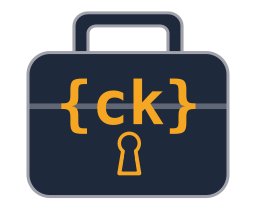

# confkoffer



Bundle, encrypt, and ship project configuration files to an object store
— and reverse the flow on retrieval. Backends: any S3-compatible store,
Azure Blob Storage, Google Cloud Storage, or a plain directory.

## The problem

Real projects accumulate sensitive configuration that doesn't belong in
git: provider credentials, backend configs, `.env` files, local
overrides, signing keys. Today, teammates onboard a new machine by
re-running setup scripts from memory, copy-pasting from chat history,
or DM'ing each other zipped folders. Hopping between your laptop, a
work desktop, and a CI box means doing it again. It's tedious,
error-prone, and the "just send me the env file" exchanges are exactly
the kind of thing security audits flag.

confkoffer is a small, focused tool that solves this in a simple and
secure way: pack the files you care about, encrypt them with a
passphrase, push them to a bucket. On any other machine — or after
wiping yours — pull them back down with one command. No GPG keyrings
to sync, no shared password manager folders, no zip-on-Slack. The
bucket can be world-readable as far as confkoffer is concerned;
confidentiality lives in the passphrase.

The name blends **conf**iguration + **koffer** (German for _suitcase_),
echoing the English _coffer_ (strongbox). A trusted suitcase for your
configs.

confkoffer is project-agnostic. It does not assume Terraform, Ansible,
Kubernetes, or any specific tool: it packs whatever your `patterns.include`
list selects.

---

## Threat model

confkoffer protects the **confidentiality and integrity** of bundled
config files at rest in whichever store you point it at. The trust
anchor is the passphrase you supply at pack time. An attacker who reads
or copies the bucket, container, or directory cannot recover the
plaintext without that passphrase.

- Symmetric encryption only — there are no keys to lose, no key servers
  to operate, and no PKI to maintain.
- KDF: Argon2id (OWASP "second-choice" defaults: 19 MiB / t=2 / p=1).
  Each blob carries its own KDF parameters, so you can rotate to a
  stronger profile later without breaking old blobs.
- Cipher: AES-256-GCM. The 35-byte cleartext header is fed in as
  Associated Data, so any tamper (incl. weakening the recorded KDF
  parameters) invalidates the auth tag and decryption fails.

**Use a long passphrase.** Four random words from a wordlist, or 16+
random characters. The KDF makes brute-forcing slow, not impossible.

confkoffer does **not** protect against:

- a compromised local machine where the passphrase is typed or piped;
- a passphrase you also use somewhere else and have leaked elsewhere;
- the bucket operator subpoenaing or mishandling the **encrypted** blob
  (still encrypted, but they have a copy);
- side channels in your own scripts or CI.

---

## Install / build

```sh
go install github.com/renewelches/confkoffer/cmd/confkoffer@latest
# or build from source:
git clone <repo> && cd confkoffer
make build                      # produces ./bin/confkoffer
```

Requires Go 1.26+.

---

## Quickstart

```sh
# 1. Scaffold a config in your project root.
confkoffer init

# 2. Edit .confkoffer.yaml — set 'name', pick a storage provider,
#    review patterns.
$EDITOR .confkoffer.yaml

# 3. Export credentials for your provider (via env, never via flags).
#    aws / s3 / minio:
export AWS_ACCESS_KEY_ID=...
export AWS_SECRET_ACCESS_KEY=...
# Only needed for non-AWS S3 (or an AWS FIPS/VPC endpoint):
# export AWS_ENDPOINT=object.storage.example.de
#    azure: AZURE_STORAGE_ACCOUNT plus AZURE_STORAGE_KEY (or a SAS token)
#    gcp:   gcloud auth application-default login
#    file:  nothing — filesystem permissions are the access control

# 4. Pack the matched files. You'll be prompted for a passphrase twice.
confkoffer pack

# 5. Later — restore the latest snapshot into restored/:
confkoffer unpack --output-dir restored/

# Or list snapshots and pick a specific one:
confkoffer list
confkoffer unpack --object-key 'my-project/2026-04-28T10-15-00Z-7d4e.enc'

# Or restore as of a point in time:
confkoffer unpack --at 2026-04-28T12:00:00Z
```

---

## Subcommands

| Command  | Purpose                                                                |
| -------- | ---------------------------------------------------------------------- |
| `init`   | Write a `.confkoffer.yaml` template into CWD. `--force` overwrites.    |
| `pack`   | Walk source dir, encrypt, upload as `<name>/<ts>-<rand4>.enc`.         |
| `unpack` | Download a snapshot (default: newest), decrypt, extract.               |
| `list`   | Print snapshots under `<name>/`, newest first, with size + key.        |

### `unpack` selection flags

`unpack` picks a snapshot using exactly one of:

- (default) the **newest** under `<name>/` by `LastModified`.
- `--object-key <key>` — fetch this exact key.
- `--at <RFC3339>` — newest snapshot at-or-before this UTC timestamp.

`--object-key` and `--at` are mutually exclusive.

**Which timestamp decides.** Both "newest" and `--at` are judged by the
store's `LastModified`, never by the timestamp written into the key.
Each snapshot carries two times, and they answer different questions:

| Timestamp                 | Set by       | Means                                    |
| ------------------------- | ------------ | ---------------------------------------- |
| in the key (`<ts>`)       | `pack`       | when the snapshot was packed             |
| `LastModified`            | the store    | when this store last wrote the object    |

They normally agree. They diverge when objects are copied between
buckets, synced with `rclone`/`aws s3 sync`, or restored from a
lifecycle tier — all of which rewrite `LastModified` while the key keeps
its original label.

The store's view wins, deliberately: a point-in-time restore is asking
"what did this bucket hold at time *t*", and only the store can answer
that. Selecting on the key would hand back a snapshot that was not in
the bucket at *t*. The tradeoff is that a store with a skewed clock
skews `--at` along with it. If you need the packing time instead, read
it off the key and use `--object-key`.

`--overwrite` controls behaviour when an extracted file already exists
in `--output-dir`. Default is to skip and report.

---

## Config file reference

Lives in CWD as `.confkoffer.yaml`. Override path with `--config`. There
is no walk-up of parent directories — discovery is CWD-only.

```yaml
name:
  my-project # required; lowercase alnum + dashes,
  # may use "/" for nesting (prod/aws/useast)

storage:
  provider: aws # required; see the provider table below
  bucket: confkoffer # default if omitted: 'confkoffer'
  region: eu-central-1 # default: us-east-1
  # endpoint: ... # optional for aws; required for s3/minio

crypto: # optional; omit entirely for the defaults
  argon2id: # shown: OWASP first-choice (stronger than the default)
    memory_kib: 47104
    time: 1
    threads: 1

patterns:
  include:
    - "**/*.tf"
    - "**/*.tfvars"
    - "secrets/prod.env" # literal paths also work
  exclude:
    - "**/*.tfstate"
    - ".terraform/**"

password: # optional; default chain: flag -> env -> prompt
  source: pass # one of: prompt | env | flag | pass | command
  pass:
    path: backups/confkoffer/my-project
  # OR universal exec source:
  # source: command
  # command:
  #   argv: ["op", "read", "op://Personal/confkoffer/password"]
  #   timeout: 10s
```

### Storage providers

`storage.provider` selects the backend and determines which other keys
apply. Unknown keys are rejected with the list of the ones that are
valid for that provider.

| `provider`      | Required            | Optional                              |
| --------------- | ------------------- | ------------------------------------- |
| `aws`           | `bucket`            | `region`, `endpoint`, `insecure`      |
| `s3` \| `minio` | `bucket`, `endpoint` | `region`, `insecure`                 |
| `azure`         | `containerid`       | —                                     |
| `gcp`           | `bucket`            | `universe_domain`                     |
| `file`          | `dirpath`           | —                                     |

**`insecure` and the endpoint scheme.** `endpoint` may be written bare
(`minio.example:9000`) or with a scheme. A scheme, if present, **wins
over `insecure`** in both directions:

| `endpoint`             | `insecure` | Transport                |
| ---------------------- | ---------- | ------------------------ |
| `https://minio.example` | `true`    | **https** — scheme wins  |
| `http://minio.example`  | `false`   | **http** — scheme wins   |
| `minio.example`         | `true`    | http — `insecure` decides |
| `minio.example`         | unset      | https — the default      |

The scheme is the more specific statement: it names the transport for
that one endpoint, where `insecure` is a standing setting on the block.
Letting `insecure` downgrade an explicit `https://` would send your
access key in cleartext to a host the config said to reach over TLS —
the one direction that must never happen quietly.

Any insecure result logs a warning, except to `localhost`, `127.0.0.1`,
and `::1`, where cleartext is the expected local-MinIO workflow and a
warning on every run would only teach you to ignore it.

`aws`, `s3`, and `minio` are three names for the same S3-compatible
configuration. They differ only in whether `endpoint` is required:

- **`aws`** talks to AWS S3. `endpoint` is an optional override for
  FIPS, dualstack, or VPC interface endpoints.
- **`s3`** (alias `minio`) is for everything else that speaks S3 —
  MinIO, Ceph RadosGW, StackIT, Wasabi, Cloudflare R2, DigitalOcean
  Spaces, Hetzner. `endpoint` is **required**, so a missing one is an
  error rather than a silent redirect of your snapshots to AWS.

```yaml
# Self-hosted or third-party S3
storage:
  provider: s3
  bucket: confkoffer
  endpoint: object.storage.example.de
  region: eu01

# A plain directory — local disk or any mounted share (NFS, SMB, sshfs).
# confkoffer does not know or care which; the mount is yours to manage.
storage:
  provider: file
  dirpath: /mnt/backups/confkoffer
```

#### Azure and GCS: account, project, and region

Both `azure` and `gcp` name only the container or bucket. That is
deliberate, and the same two reasons apply to each:

- **The account or project comes from the credential environment** —
  `AZURE_STORAGE_ACCOUNT` (beside `AZURE_STORAGE_KEY`,
  `AZURE_STORAGE_CONNECTION_STRING`, or `AZURE_STORAGE_SAS_TOKEN`) and
  Google Application Default Credentials respectively. That is the same
  policy as `AWS_ACCESS_KEY_ID`: identity lives in the environment, not
  in a file you commit. Naming it in both places only creates a way for
  the two to disagree.
- **The region is not a client setting.** An Azure storage account's
  region is chosen when the account is created and encoded in its DNS
  name (`<account>.blob.core.windows.net`); a GCS bucket's location is
  fixed at creation and immutable. Neither SDK accepts a region
  parameter for blob access.

```yaml
storage:
  provider: azure
  containerid: my-container
```

Contrast `s3`, which *does* take a `region`: the SigV4 signature embeds
it, so an S3 client has to know it. Azure and GCS authenticate with
tokens that carry no location.

#### GCS and data residency

`gcp` takes only a bucket. There is no project and no region key, and
both omissions are deliberate:

- **Project** comes from Application Default Credentials, alongside the
  credentials themselves. Repeating it in config would only create a way
  for the two to disagree.
- **Region** is not a client-side concept for GCS. A bucket's location
  (`US`, `EU`, `europe-west3`, `me-central2`, …) is fixed when the
  bucket is created and immutable afterwards; `gs://<bucket>` resolves
  globally. This differs from S3, where `region` is required because the
  SigV4 signature embeds it — GCS authenticates with OAuth bearer tokens
  that carry no location.

So **data residency is set when you create the bucket**, not in
confkoffer:

```sh
gcloud storage buckets create gs://my-backups --location=me-central2
```

confkoffer then reaches it with no extra configuration. The Go SDK
exposes no region parameter for GCS at all, so a `region` key here would
be inert.

```yaml
storage:
  provider: gcp
  bucket: my-backups
```

`universe_domain` is the one client-side residency control, and it is
for sovereign or partner clouds that serve a different API domain than
`googleapis.com`. Leave it unset for public GCP.

### Backend status

All providers go through one `gocloud.dev/blob` layer (`s3blob`,
`azureblob`, `gcsblob`, `fileblob`), so `pack`, `unpack`, `list`, and
`--at` share the same retry, size-cap, and ordering code everywhere.

| `provider`              | Status                                                                 |
| ----------------------- | ---------------------------------------------------------------------- |
| `aws` / `s3` / `minio`  | Verified end to end against AWS-style S3 and self-hosted MinIO.        |
| `file`                  | Verified end to end; `go test ./internal/store` round-trips against a real directory. |
| `azure`, `gcp`          | Implemented; URL and validation logic is tested, but not yet exercised against a live account. Reports welcome. |

### The `file` provider

`file` is a directory. confkoffer does not know or care whether that
directory is local disk, NFS, SMB, or sshfs — there is no
network-filesystem-specific code, and none of those protocols' semantics
are offered. The mount is yours to manage.

- **Writes are atomic.** Each snapshot is written to a temp file beside
  its destination and renamed into place on completion, so an
  interrupted `pack` never leaves a truncated `.enc` that `list` would
  present as valid. The temp file must be on the same filesystem as the
  target, which it always is — it is created in the same directory.
- **Directories are created on demand**, including `dirpath` itself and
  the `<name>/` subdirectories in each key.
- **Each snapshot has a `.attrs` sidecar** (`<key>.enc.attrs`) holding
  the content type. It is metadata, not a second copy; keep it next to
  its `.enc` when moving snapshots around.
- **`LastModified` is the file's mtime**, and newest-first and `--at`
  select on it (see [which timestamp decides](#unpack-selection-flags)).
  Unlike an object store's timestamp, mtime is rewritten by `touch`,
  `cp` without `-p`, or `rsync` without `-t`. When copying a snapshot
  directory, preserve times — or fall back to `--object-key`, whose key
  timestamp travels with the file.

**The threat model is not the same as S3's.** Confidentiality is
unchanged — blobs are Argon2id + AES-256-GCM wherever they live — but
the guarantees around them are weaker:

- S3 offers versioning, object lock, and MFA delete. A directory offers
  POSIX permissions.
- NFSv3 with `AUTH_SYS` trusts whatever uid the client asserts: anyone
  who can mount the export can **delete** your snapshots.
- **Encryption protects confidentiality, not availability.** An attacker
  who cannot read your backups can still destroy them. Keep a second
  copy somewhere they cannot reach.

### Crypto parameters

`crypto.argon2id` tunes the key-derivation cost. The block is optional;
omit it and you get the OWASP **second-choice** profile:

| Key          | Default | Meaning                            |
| ------------ | ------- | ---------------------------------- |
| `memory_kib` | `19456` | Memory cost in KiB (19 MiB)        |
| `time`       | `2`     | Iterations                         |
| `threads`    | `1`     | Parallelism                        |

The OWASP **first-choice** profile — more memory, fewer passes — is
`memory_kib: 47104`, `time: 1`, `threads: 1`.

Three things to know about this block:

**It is YAML-only.** There is deliberately no `--argon2-memory` flag and
no environment variable. The KDF cost is a security parameter that
should be committed, reviewed, and identical for everyone who packs a
given project — not something a CI script can quietly weaken per run.

**It only affects `pack`.** Snapshots are self-describing: the
parameters are stored in the blob's cleartext header and read back on
`unpack`. Changing this block never makes an existing snapshot
unreadable, and old snapshots keep decrypting with the parameters they
were written with. To re-encrypt existing snapshots under new
parameters you would need a `rekey` command, which does not exist yet
(tracked in [#16](https://github.com/renewelches/confkoffer/issues/16)).

**It is all-three-or-nothing.** An entirely absent block means "use the
defaults". A block with only some keys set leaves the rest at zero and
fails validation with exit code 2, rather than silently deriving a much
weaker key:

```
argon2id memory_kib 0 is too small (must be >= 8*threads and > 0)
```

Constraints: `memory_kib` must be `>= 8 * threads` and non-zero; `time`
and `threads` must each be `>= 1`.

**Unknown keys are rejected**, as everywhere else in the schema:

```
$ confkoffer list
error: parse .confkoffer.yaml: line 3: crypto.argon2id has unknown key
"memory_kb"; allowed keys are: memory_kib, threads, time
```

This matters more here than it looks. A silently-dropped `memory_kb`
would leave all three parameters at zero, which reads as "block absent"
— and your hardened settings would be replaced by the defaults with
nothing printed to say so.

### Resolution order

For any field that **can** be overridden:

> CLI flag &gt; env var &gt; YAML config &gt; built-in default

Most settings cannot be. Only four of the twenty have flag or
environment equivalents:

| YAML key                                          | Flag         | Env                 |
| ------------------------------------------------- | ------------ | ------------------- |
| `name`                                            | `--name`     | `CONFKOFFER_NAME`   |
| `storage.bucket`                                  | `--bucket`   | `CONFKOFFER_BUCKET` |
| `storage.region`                                  | `--region`   | `AWS_REGION`        |
| `storage.endpoint`                                | `--endpoint` | `AWS_ENDPOINT`      |
| `storage.provider`                                | —            | —                   |
| `storage.insecure`                                | —            | —                   |
| `storage.containerid`                             | —            | —                   |
| `storage.dirpath`                                 | —            | —                   |
| `storage.bucket` (gcp), `universe_domain`         | —            | —                   |
| `crypto.argon2id.*`                               | —            | —                   |
| `patterns.include`, `patterns.exclude`            | —            | —                   |
| `password.source`                                 | —            | —                   |
| `password.pass.path`                              | —            | —                   |
| `password.command.argv`, `timeout`                | —            | —                   |

The three `--bucket` / `--endpoint` / `--region` overrides describe an S3
endpoint and apply to the `aws`, `s3`, and `minio` providers only.
Passing one against `azure`, `gcp`, or `file` is an **error**, not a
silent no-op:

```
$ confkoffer list --bucket other-bucket        # storage.provider: file
error: storage provider file does not accept --bucket; those flags
configure an S3 endpoint (providers: aws, s3, minio)
```

A flag that appears to work but changes nothing is how a snapshot ends
up somewhere you did not intend. The environment variables are treated
differently: `CONFKOFFER_BUCKET` and friends are ambient and may well be
exported for another tool in the same shell, so against a non-S3
provider they are ignored rather than rejected.

Some of these are deliberate: `patterns` are lists, which make poor
flags; `password.*` is structural rather than per-invocation; and
`crypto.argon2id` is [intentionally file-only](#crypto-parameters).

> **Running without a config file.** `storage.provider` has no flag, but
> naming a bucket or endpoint explicitly is enough on its own: confkoffer
> then assumes `provider: aws`, which is what the schema meant before
> providers existed. Because `aws` accepts an optional endpoint override,
> this reaches self-hosted S3 too:
>
> ```sh
> confkoffer unpack --name my-project \
>   --bucket confkoffer \
>   --endpoint https://minio.grumples.home:9000
> ```
>
> This matters for disaster recovery: `.confkoffer.yaml` is CWD-only with
> no walk-up, so on a fresh machine there is nothing to read — and the
> file you need is often the very thing you are restoring.
>
> The fallback only fires when the config file supplies no `storage`
> block **and** you named a bucket or endpoint. A bare `confkoffer pack`
> with neither still fails with `missing required configuration: storage`
> rather than inventing a bucket you never asked for. A `storage` block
> in the file always wins.
>
> Non-S3 providers (`azure`, `gcp`, `file`) have no flags at all and need
> a config file.

### Pattern semantics

- `patterns.include` — glob patterns (or literal paths). A file is a
  candidate if it matches **at least one** include.
- `patterns.exclude` — patterns. A candidate is dropped if it matches
  **any** exclude. Exclude wins.
- `**` matches any number of directory segments. `*` matches one segment
  (does not cross `/`).
- Ergonomic shortcut: `**/foo` also matches `foo` at depth zero (saves
  having to write both `*.tf` and `**/*.tf`).
- Symlinks are skipped (logged at WARN).

---

## Password sources

| Source    | When to use                                                  | Notes                                                                      |
| --------- | ------------------------------------------------------------ | -------------------------------------------------------------------------- |
| `prompt`  | Interactive sessions                                         | No-echo via x/term; double-confirm on `pack`. 3 attempts then exit code 2. |
| `flag`    | Tests, one-off                                               | `--pass <value>` — leaks via shell history.                                |
| `env`     | CI with secret-managers piping in                            | `CONFKOFFER_PASS` — leaks via `/proc/$$/environ` if not careful.           |
| `pass`    | passwordstore.org users                                      | `password.pass.path: backups/confkoffer/<name>`                            |
| `command` | Vault, 1Password, Bitwarden, KeePassXC, anything with stdout | `password.command.argv: [...]` and optional `timeout: 10s`.                |

### Recommendations

- **For interactive use**: leave `password:` unset and you'll get
  `flag → env → prompt` chain.
- **For automation/cron**: use `pass` or `command`. Never use `--pass`
  or `CONFKOFFER_PASS` for unattended jobs — env vars are world-readable
  via `/proc` on most systems and shell history retains flag values.
- The `command` source's `argv` is **never logged**. Other secret-shaped
  field names (`password`, `key`, `secret`, `token`, `pass`) are also
  scrubbed from log output by default.

---

## Environment variables

| Variable                | Purpose                                       |
| ----------------------- | --------------------------------------------- |
| `AWS_ACCESS_KEY_ID`     | S3 credentials (always env)                   |
| `AWS_SECRET_ACCESS_KEY` | S3 credentials (always env)                   |
| `AWS_ENDPOINT`          | S3 endpoint                                   |
| `AWS_REGION`            | S3 region (overrides YAML, behind `--region`) |
| `AZURE_STORAGE_ACCOUNT` | Azure account, beside its key/SAS/connection string |
| `CONFKOFFER_NAME`       | Project name; also the key prefix             |
| `CONFKOFFER_BUCKET`     | S3 bucket                                     |
| `CONFKOFFER_PASS`       | Passphrase (avoid for automation)             |

Google Cloud Storage uses Application Default Credentials
(`gcloud auth application-default login`, or `GOOGLE_APPLICATION_CREDENTIALS`).
The `file` provider needs no credentials — filesystem permissions are
the access control.

---

## Exit codes

| Code | Meaning                                                                                                 |
| ---- | ------------------------------------------------------------------------------------------------------- |
| 0    | Success                                                                                                 |
| 1    | General runtime error: network, decrypt failure, no snapshots, file IO, password manager exec failure   |
| 2    | Config error: missing required fields, malformed YAML, unknown keys, name validation failed, malformed storage location, a flag the provider does not accept, prompt retries exhausted |

---

## Object key layout

```
<name>/<RFC3339-utc-with-:-as-->-<rand4>.enc
```

Example:

```
prod/aws/useast/2026-04-28T12-34-56Z-7d4e.enc
```

- `<name>` is your project / tree path; `[a-z0-9-]+` per segment, may
  contain `/` for nesting.
- `<rand4>` is 4 random hex chars from `crypto/rand`. Eliminates
  same-second collisions.

**Listing semantics**: `unpack` and `list` use `LastModified` from the
store as the authority. The timestamp in the key is a human-readable
label only — server clocks win on conflict. See
[which timestamp decides](#unpack-selection-flags) for why, and for when
the two diverge.

---

## Retention

confkoffer never deletes objects (a `prune` command is tracked in
[#21](https://github.com/renewelches/confkoffer/issues/21)). Expire old
snapshots with the store's own tooling:

- **S3 / MinIO** — a bucket lifecycle rule (example below). confkoffer
  only needs `s3:PutObject`, `s3:ListBucket`, and `s3:GetObject`.
- **Azure** — a Blob Storage lifecycle management policy.
- **GCS** — Object Lifecycle Management (`gcloud storage buckets update
  --lifecycle-file`).
- **`file`** — a scheduled `find <dirpath> -name '*.enc*' -mtime +90
  -delete`. Match `*.enc*` so each `.attrs` sidecar goes with its blob.

Example AWS lifecycle rule (delete after 90 days):

```json
{
  "Rules": [
    {
      "ID": "expire-old-confkoffer",
      "Status": "Enabled",
      "Filter": { "Prefix": "" },
      "Expiration": { "Days": 90 }
    }
  ]
}
```

---

## Local testing with MinIO

Use `provider: s3` (or the `minio` alias) with an explicit endpoint:

```yaml
storage:
  provider: s3
  bucket: confkoffer
  endpoint: localhost:9000
  insecure: true # http:// — loopback only
```

```sh
docker run --rm -p 9000:9000 -p 9001:9001 \
  -e MINIO_ROOT_USER=minio \
  -e MINIO_ROOT_PASSWORD=minio12345 \
  minio/minio server /data --console-address ":9001"

# In another terminal: create the bucket via the web UI
# (http://localhost:9001) or with `mc mb local/confkoffer`.

export AWS_ENDPOINT=http://localhost:9000
export AWS_ACCESS_KEY_ID=minio
export AWS_SECRET_ACCESS_KEY=minio12345
export CONFKOFFER_PASS=test-passphrase-with-enough-bits

confkoffer init
$EDITOR .confkoffer.yaml          # set name; use the provider: s3 block
confkoffer pack
confkoffer list
confkoffer unpack --output-dir restored/
```

---

## Roadmap

- **Hashicorp Vault password source** — typed source with AppRole auth
  and lease renewal. Will be a new file in `internal/password/`; no
  interface changes required.
